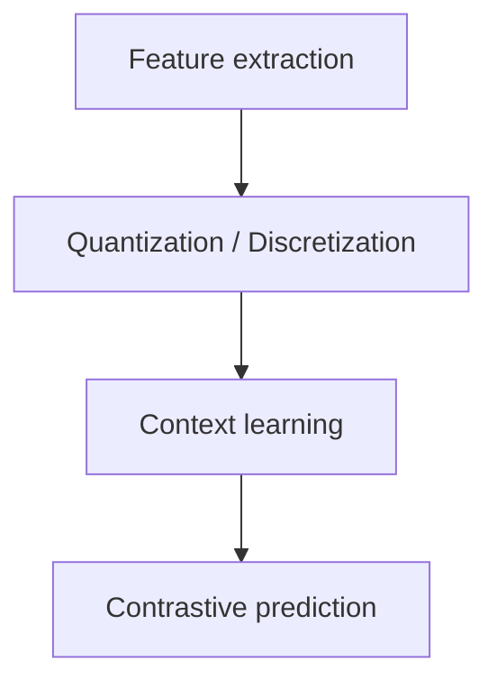

_(this can later be converted into a more formal format, e.g. latex. An AI could be asked
to perform conversion automatically)_

# Explanation of wav2vec algorithm

## Pipeline

Pipeline looks as follows (for both 1.0 and 2.0 versions):

Both 1.0 and 2.0 versions differ in the last step:

- 1.0 uses **continuous** prediction
- 2.0 uses **discrete** prediction

### pipeline: 1. Feature extraction

This is performed via the use of a CNN encoder head. Its purpose is to extract relevant
features and reduce dimensionality of the problem space.

It makes the task computationally feasible.

### pipeline: 2. Quantization

All relevant context-learning algorithms, such as the ones used for the similarly-named
word2vec and node2vec, require discrete tokens to work with.

## Sources

- https://ai.meta.com/blog/wav2vec-20-learning-the-structure-of-speech-from-raw-audio/
