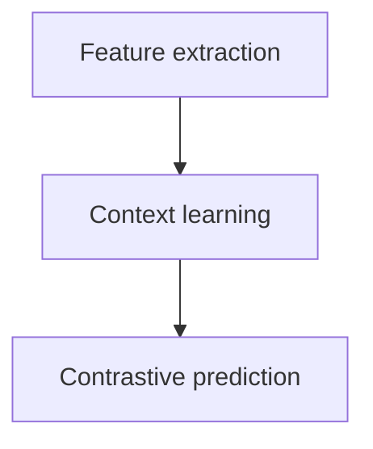

*(this can later be converted into a more formal format, e.g. latex. An AI could be asked
to perform conversion automatically)*

# Explanation of wav2vec algorithm

## Pipeline

Pipeline looks as follows (for both 1.0 and 2.0 versions):

Both 1.0 and 2.0 versions differ in the last step:
- 1.0 uses **continuous** prediction
- 2.0 uses **discrete** prediction